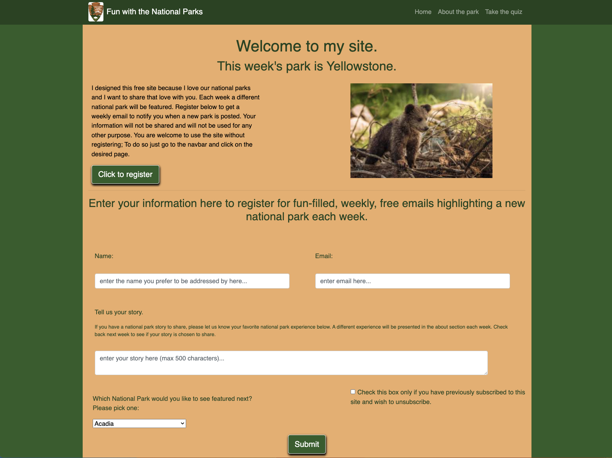
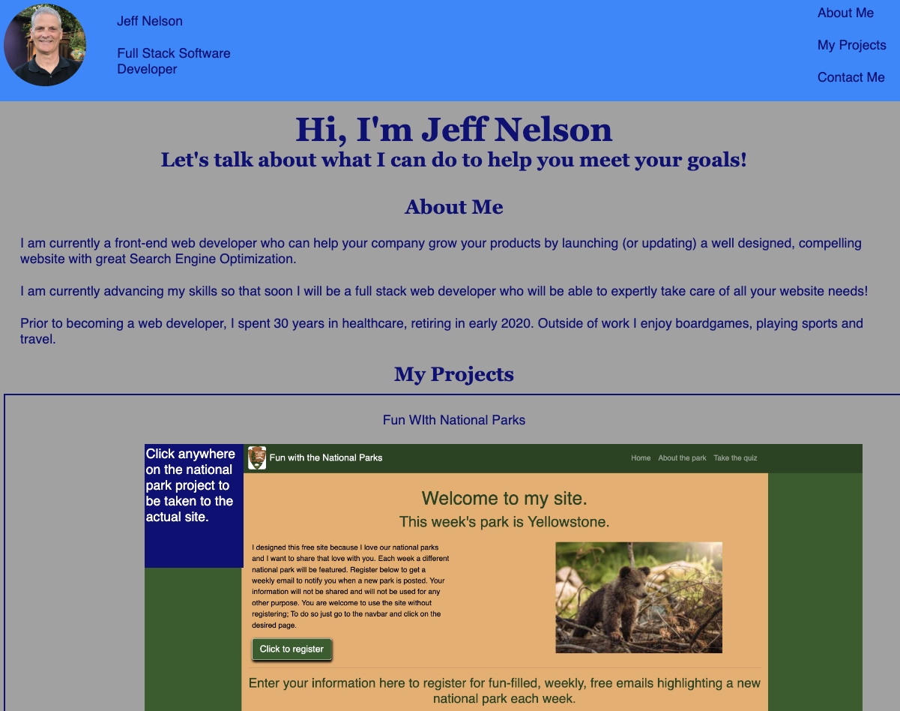

# Jeff-Nelson-Portfolio

---

## Technology Used 

| Technology Used         | Resource URL           | 
| ------------- |:-------------:| 
| HTML    | [https://developer.mozilla.org/en-US/docs/Web/HTML](https://developer.mozilla.org/en-US/docs/Web/HTML) | 
| CSS     | [https://developer.mozilla.org/en-US/docs/Web/CSS](https://developer.mozilla.org/en-US/docs/Web/CSS)      |   
| Git | [https://git-scm.com/](https://git-scm.com/)     |    

---

## Description

[Visit the Deployed Site](https://jeffreydne.github.io/Jeff-Nelson-Portfolio)

Designed my portfolio from scratch

---

## Code Example

The below HTML and CSS examples show how I use flexbox to make the website align correctly and to be responsive:

```HTML
   <div class="card">
        <p class="card-header">Fun WIth National Parks</p>
        <a href="https://jeffreydne.github.io/national-park-blog-yellowstone/"></a>
        <p class="card-footer">This project represents the 1st episode of a weekly blog, featuring a different National Park each week. This 1st week features Yellowstone. It contains a signup & information page, an about the park page, and a page with a timed quiz, about the park, for the user to take.</p>
    </div>
```
```CSS
  .card {
    display:flex;
    flex-direction: column;
    justify-content: center;
    align-items: center;
    border: 2px double navy;
    margin: 10px;
    /* align-items: center; */
  }
  .card-header, .card-footer {
    width: 70%;
    text-align: center;
  }
  p {
    margin: 20px 30px;
  }
  section a {
    display: flex;
    justify-content: center;
  }
  a img {
    width: 80%;
  }
```
## Usage

This portfolio is designed to give any interested party an idea of websites I have designed in the past, what technologies I have learned and the quality products that I am capable of producing. The homepage of my portfolio is seen on this screenshot

```md

```
---

## Learning Points

During the making of this portfolio I implemented HTML and CSS keeping in mind accessability standards, search engine optimization and best practices. I also strove to design a visually pleasing site that will represent me well. 

* I designed a mobile first responsive site using flexbox and @media to make the site function well at desktop, tablet and mobile sizes

* Using @media screen with a max-width of 600px I implemented a change in the layout to a verticle orientation of the navbar elements and the projects so that they will continue to be legible as they move to a verticle stacking

* Currently the featured project site is larger than the others unless the screen width is narrower than 600px. This is acheived by putting the 2 non-featured projects in a separate division, aligning them in a row, with each project taking a width of 40%. The featured projecct is then aligned with the container division of the smaller projects using a flex direction column.  

* I made use of the anchor tag to allow the user to click on the image of the featured site to get sent to the deployed website.  
---

## Author Info

```md
### Jeffrey Nelson


* Portfolio(coming soon)
* [LinkedIn](https://www.linkedin.com/in/jeffrey-nelson13/)
* [Github](https://github.com/Jeffreydne)
```

---
## Credits
Note: I started this project in September 2023 while in the UCB Fulltime Bootcamp. I transferred after one week.

The table of technology used  in this README.md was provided by the excellent staff at UC Berkeley Extension Full Stack Bootcamp
